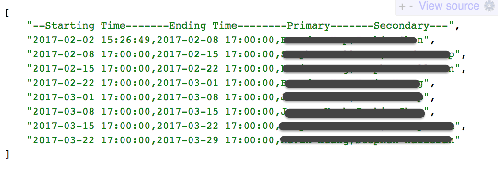

# Opsgenie Schedule Generator

## Overview
Opsgenie schedule generator is a tool that can create Excel spreadsheet based on the Opsgenie schedule.  

In my practise, there are two support staffs for each week - Primary and Secondary. Sencodary is the primary of the previous week. 
   
## How to use?
```bash
# install requirements
pip install -r requirements.txt

# setup api key 
export OPSGENIE_API_KEY='4e69491b-XXXXXXXXXXXXXXXXXXXXXX'

# run it
python oncall.py
```
## Lambda
AWS Lambda function is also available. Set it up in AWS with AWS API gateway. Then you can have a RESTful AVPI for your roster schedule!


